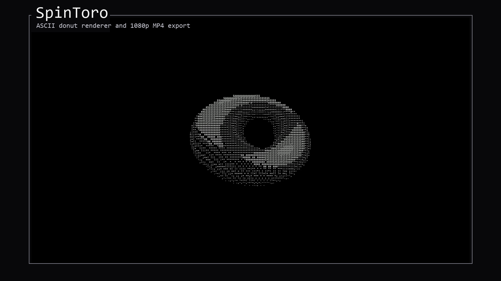

# SpinToro

<p align="center">
	
</p>

<p align="center">
	A polished ASCII donut renderer for the console and a 1080p MP4 exporter for wallpaper-style playback.
</p>

<p align="center">
	<strong>Console mode</strong> · <strong>MP4 export</strong> · <strong>Monospace PIL render</strong> · <strong>Progress bar</strong>
</p>

## Overview

SpinToro is a Python project that keeps the classic rotating ASCII donut math intact while giving it a second life as a high-resolution video asset. The repo ships with two entry points:

- [console.py](console.py) restores the original terminal animation and prints the donut directly to your console.
- [main.py](main.py) renders the same donut into 1920x1080 frames and exports a ready-to-use MP4.

The core trigonometry is preserved on purpose. The `xyz`, `xyprime`, and `L` functions still define the torus geometry, the screen projection, and the lighting response, and the Z-buffer logic still decides which ASCII character is visible at each position.

## Preview

The image above is a frame extracted from the generated animation and composed as a README hero. It shows the final look of the project more clearly than a text-only description can.

## What Makes It Interesting

- The donut is rendered from pure mathematics, not from a mesh asset.
- The video exporter uses Pillow to draw the ASCII buffer onto a full HD canvas.
- The animation is tuned to move more slowly than the original console version while keeping a high output frame rate.
- A progress bar is shown during export so long renders remain observable.
- The final MP4 is suitable for looping wallpaper workflows.

## How It Works

At a high level, each frame is produced in four stages:

1. The torus is sampled with `theta` and `phi`.
2. The global angles `A` and `B` rotate the geometry.
3. Each projected point is compared against a Z-buffer so only the closest visible sample survives.
4. The surviving sample is converted into an ASCII character and rendered.

In `main.py`, that ASCII frame is centered inside a black 1920x1080 image, drawn with a monospaced font, and written to disk as an MP4 file.

## Quick Start

Install the dependencies used by the video exporter:

```bash
pip install pillow numpy opencv-python imageio imageio-ffmpeg progressbar2
```

Run the console version if you want the original terminal effect:

```bash
python console.py
```

Run the main exporter when you want the MP4 file:

```bash
python main.py
```

Running `main.py` is what generates and "downloads" the video artifact into the project folder.

## Output

By default, the exporter writes:

- `donut_3d_1080p.mp4`

If that filename is already locked or unavailable, the script automatically falls back to a numbered variant such as `donut_3d_1080p_1.mp4`.

## Tuning the Look

The current configuration is intentionally tuned for a wallpaper-friendly result. The most useful controls live in [main.py](main.py):

- `velocidad_rotacion`: lowers or raises the angular speed.
- `fps`: controls video playback speed.
- `wide` and `high`: adjust ASCII buffer density.
- `K1`: changes the apparent size of the donut inside the frame.
- `video_w` and `video_h`: define the final export resolution.

## Repository Layout

- [main.py](main.py): MP4 export pipeline.
- [console.py](console.py): original console animation.
- [assets/donut-preview.png](assets/donut-preview.png): README preview image.
- [.gitignore](.gitignore): ignores generated media and local tooling files.
- [LICENSE](LICENSE): MIT license.
- [CODE_OF_CONDUCT.md](CODE_OF_CONDUCT.md): community behavior guidelines.
- [CONTRIBUTING.md](CONTRIBUTING.md): contribution workflow.
- [SECURITY.md](SECURITY.md): security reporting guidance.

## Project Policy

Generated MP4 files are intentionally ignored so the repository stays small and focused on source code and documentation. The README includes the preview image as a committed asset because it helps explain the project at a glance.

## License

This project is distributed under the MIT License. See [LICENSE](LICENSE) for the full terms.

## Contributing

Please read [CONTRIBUTING.md](CONTRIBUTING.md) before opening a pull request.

## Security

Security issues should be reported privately according to [SECURITY.md](SECURITY.md).

## Code of Conduct

This project follows the [Code of Conduct](CODE_OF_CONDUCT.md).
